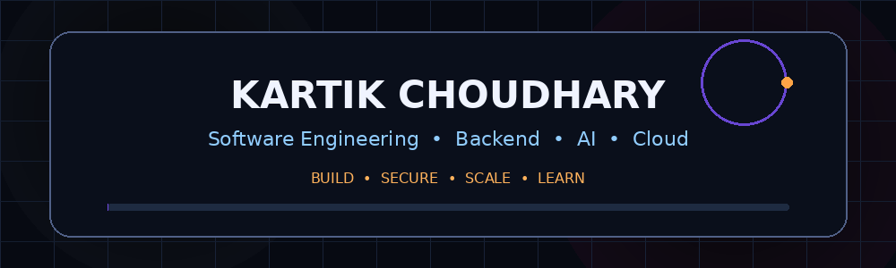

<div align="center">



### BUILD • SECURE • SCALE • LEARN

<a href="https://github.com/kartikchoudharyaktu">

</a>
<a href="https://github.com/kartikchoudharyaktu?tab=repositories">

</a>

</div>

---

## 👋 About Me

I'm **Kartik Choudhary**, focused on building reliable software systems and continuously improving engineering skills.

My work and interests span:

- 🧩 Backend & API Engineering
- 🏢 Enterprise Business Systems
- 🔐 Security & Access Control
- 🗄️ Data-driven Applications
- 🤖 AI & Applied Machine Learning
- ☁️ Cloud & Deployment Engineering
- 🧪 Testing, Reliability & Production Practices

> **Engineering mindset:** understand → design → build → test → observe → improve.

---

## ⚡ Engineering Focus

| Area | Focus |
|---|---|
| 🏗️ Backend | REST APIs, business logic, validation, transactions |
| 🏢 Enterprise | ERP, finance, banking, HR, supply-chain workflows |
| 🔐 Security | Authentication, authorization, RBAC, secure configuration |
| 🗄️ Data | SQL, PostgreSQL, schema design, migrations |
| 🤖 AI / Data | Analytics, forecasting, machine learning applications |
| 🐳 DevOps | Docker, Nginx, CI/CD, deployment practices |
| 🧪 Quality | Integration, validation and security testing |

---

## 🛠️ Tech Stack

**Languages**

`Java` `Python` `JavaScript` `SQL` `C`

**Backend & APIs**

`Spring Boot` `REST API` `JWT` `RBAC`

**Databases**

`PostgreSQL` `SQL` `Flyway`

**Frontend**

`HTML5` `CSS3` `JavaScript` `React`

**AI / Data**

`Python` `NumPy` `Pandas` `PyTorch`

**DevOps & Tools**

`Git` `GitHub` `Docker` `Nginx` `Linux` `AWS`

---

## 🧭 Start Here

If you're reviewing this profile for engineering work, these are the best starting points:

| Priority | Project | Why it matters |
|---:|---|---|
| ⭐ 1 | [OneCore-BusinessOS](https://github.com/kartikchoudharyaktu/OneCore-BusinessOS) | Enterprise business workflows, security and multi-tenant architecture |
| ⭐ 2 | [BHARAT-ERP-SOLUTION](https://github.com/kartikchoudharyaktu/BHARAT-ERP-SOLUTION) | Broad ERP-oriented business processes |
| ⭐ 3 | [CyberShieldX](https://github.com/kartikchoudharyaktu/CyberShieldX) | Security-focused application engineering |
| ⭐ 4 | [FinCoreX](https://github.com/kartikchoudharyaktu/FinCoreX) | Banking and financial workflow architecture |
| ⭐ 5 | [SupplyChainX](https://github.com/kartikchoudharyaktu/SupplyChainX) | Procurement, inventory and supply-chain workflows |

**Portfolio:** [Kartik Choudhary — Portfolio](https://github.com/kartikchoudharyaktu/Portfoliok)

---

## 🏢 Engineering Domains

| Domain | Selected Work |
|---|---|
| ERP & Business Systems | OneCore-BusinessOS, BHARAT ERP, MicroVision Next Gen ERP |
| Banking & Finance | FinCoreX, FinCore |
| Cybersecurity | CyberShieldX |
| Supply Chain | SupplyChainX |
| Enterprise Operations | EnterpriseOps Enhanced |
| Talent & HR Workflows | TalentFlow |
| AI Applications | AI Resume Analyzer Pro |
| Web & Portfolio | Dockhand Marketing Site, Portfoliok |

---

## 🧱 Architecture & Engineering Capabilities

**Application Architecture**
- Modular business applications
- REST API-driven services
- Business-rule-oriented workflows
- Layered application design
- Multi-tenant application concepts

**Data & Persistence**
- Relational data modelling
- PostgreSQL and SQL
- Schema migrations
- Transaction-aware business logic
- Data validation and integrity

**Security**
- Authentication and authorization
- RBAC
- Secure configuration
- Access-control boundaries
- Security-oriented validation

**Reliability**
- Integration and validation testing
- Input validation
- Error handling
- Logging and observability practices
- Maintainable service boundaries

**Delivery**
- Git/GitHub workflows
- Container-oriented development
- Linux-based tooling
- CI/CD concepts
- Deployment-aware application design

---

## 🔗 Technology × Project Map

| Technology / Area | Representative Projects |
|---|---|
| Java / Spring Boot | OneCore, OneCore-BusinessOS, SupplyChainX |
| Python | CyberShieldX, FinCoreX |
| JavaScript | EnterpriseOps_Enhanced, TalentFlow, FinCore |
| SQL / PostgreSQL | OneCore-BusinessOS, OneCore, enterprise data workflows |
| AI / ML | CyberShieldX, AI Resume Analyzer Pro |
| Security / RBAC | OneCore-BusinessOS, CyberShieldX |
| ERP / Business Workflows | BHARAT ERP, MicroVision, OneCore-BusinessOS |
| Banking / Finance | FinCoreX, FinCore |
| Supply Chain | SupplyChainX |
| APIs / Integrations | EnterpriseOps Enhanced, OneCore-BusinessOS |

---

## 🧪 Quality & Engineering Discipline

The repositories are presented with an emphasis on **real implementation, transparent scope and maintainable engineering**.

Typical quality practices include:

`Validation` `Integration Testing` `Security Checks` `Error Handling` `Logging` `Documentation` `Code Review`

> Test counts and performance claims are intentionally not listed here unless independently verified for the specific repository and environment.

---

## 🔄 Engineering Workflow

```text
Understand the problem
        ↓
Design the domain and workflow
        ↓
Model data and application boundaries
        ↓
Build APIs and business logic
        ↓
Validate security and inputs
        ↓
Test integrations and critical paths
        ↓
Document the implementation
        ↓
Observe → improve → maintain
```

---

## 🚀 Flagship Engineering Work

### 🏢 OneCore-BusinessOS

Production-oriented enterprise business platform focused on multi-tenant workflows and operational management.

**Focus areas:** authentication, RBAC, tenant-aware workflows, inventory, orders, invoicing, expenses, production processes, tax logic, analytics and system reliability.

🔗 **Repository:** https://github.com/kartikchoudharyaktu/OneCore-BusinessOS

---

### 🇮🇳 BHARAT ERP

Enterprise resource planning platform covering broad business operations through integrated ERP workflows.

**Focus areas:** enterprise modules, business processes, data management and operational workflows.

🔗 **Repository:** https://github.com/kartikchoudharyaktu/BHARAT-ERP-SOLUTION

---

### 🛡️ CyberShieldX

Enterprise cybersecurity platform focused on security-oriented application workflows and defensive engineering.

**Focus areas:** authentication, security controls, monitoring-oriented workflows, secure configuration and automated validation.

🔗 **Repository:** https://github.com/kartikchoudharyaktu/CyberShieldX

---

### 🏦 FinCoreX

Enterprise banking platform designed around financial workflows, structured data and service-oriented application architecture.

**Focus areas:** banking operations, financial data workflows, APIs and extensible enterprise architecture.

🔗 **Repository:** https://github.com/kartikchoudharyaktu/FinCoreX

---

### 🚚 SupplyChainX

Enterprise supply-chain management platform covering operational workflows across procurement, inventory and supply-chain processes.

**Focus areas:** supply-chain operations, inventory workflows, business rules and enterprise application structure.

🔗 **Repository:** https://github.com/kartikchoudharyaktu/SupplyChainX

---

### ⚙️ EnterpriseOps Enhanced

Enterprise operations platform demonstrating integrated business workflows, APIs and system-level engineering practices.

**Focus areas:** backend workflows, integrations, API engineering and automated validation.

🔗 **Repository:** https://github.com/kartikchoudharyaktu/EnterpriseOps_Enhanced

---

### 👥 TalentFlow

Talent and workforce management platform focused on structured recruitment and employee-oriented workflows.

**Focus areas:** recruitment workflows, candidate data, business logic and application architecture.

🔗 **Repository:** https://github.com/kartikchoudharyaktu/TalentFlow

---

## 💡 Additional Engineering Projects

| Project | Repository |
|---|---|
| 🌐 MicroVision Next Gen ERP | [View Repository](https://github.com/kartikchoudharyaktu/MicroVision-nextgen) |
| 🇮🇳 BHARAT ERP 2026 | [View Repository](https://github.com/kartikchoudharyaktu/bharat-erp-2026) |
| 💰 FinCore | [View Repository](https://github.com/kartikchoudharyaktu/FinCore) |
| 🤖 AI Resume Analyzer Pro | [View Repository](https://github.com/kartikchoudharyaktu/resume-analyzer) |
| 🎨 Dockhand Marketing Site | [View Repository](https://github.com/kartikchoudharyaktu/dockhand-marketing-site) |
| 🏢 OneCore | [View Repository](https://github.com/kartikchoudharyaktu/OneCore) |
| 🧩 OneCore Nexus | [View Repository](https://github.com/kartikchoudharyaktu/onecore-nexus) |
| 🌐 Personal Portfolio | [View Repository](https://github.com/kartikchoudharyaktu/Portfoliok) |

---

## 📚 Complete Repository Directory

All current repositories are organized below for quick access.

| # | Repository | Purpose |
|---:|---|---|
| 1 | [bharat-erp-2026](https://github.com/kartikchoudharyaktu/bharat-erp-2026) | ERP platform |
| 2 | [BHARAT-ERP-SOLUTION](https://github.com/kartikchoudharyaktu/BHARAT-ERP-SOLUTION) | Enterprise ERP |
| 3 | [CyberShieldX](https://github.com/kartikchoudharyaktu/CyberShieldX) | Cybersecurity platform |
| 4 | [dockhand-marketing-site](https://github.com/kartikchoudharyaktu/dockhand-marketing-site) | Marketing website |
| 5 | [EnterpriseOps_Enhanced](https://github.com/kartikchoudharyaktu/EnterpriseOps_Enhanced) | Enterprise operations |
| 6 | [FinCore](https://github.com/kartikchoudharyaktu/FinCore) | Financial platform |
| 7 | [FinCoreX](https://github.com/kartikchoudharyaktu/FinCoreX) | Banking platform |
| 8 | [kartik-choudharyaktu](https://github.com/kartikchoudharyaktu/kartik-choudharyaktu) | GitHub profile repository |
| 9 | [kartikchoudharyaktu](https://github.com/kartikchoudharyaktu/kartikchoudharyaktu) | GitHub profile |
| 10 | [MicroVision-nextgen](https://github.com/kartikchoudharyaktu/MicroVision-nextgen) | Next-generation ERP |
| 11 | [OneCore](https://github.com/kartikchoudharyaktu/OneCore) | Enterprise platform |
| 12 | [OneCore-BusinessOS](https://github.com/kartikchoudharyaktu/OneCore-BusinessOS) | Business operations platform |
| 13 | [onecore-nexus](https://github.com/kartikchoudharyaktu/onecore-nexus) | OneCore ecosystem project |
| 14 | [Portfoliok](https://github.com/kartikchoudharyaktu/Portfoliok) | Personal portfolio |
| 15 | [register](https://github.com/kartikchoudharyaktu/register) | is-a.dev registration service repository |
| 16 | [resume-analyzer](https://github.com/kartikchoudharyaktu/resume-analyzer) | AI resume analysis |
| 17 | [SupplyChainX](https://github.com/kartikchoudharyaktu/SupplyChainX) | Supply-chain platform |
| 18 | [TalentFlow](https://github.com/kartikchoudharyaktu/TalentFlow) | Talent management platform |

---

## 📊 GitHub Activity

<div align="center">


<br/>


</div>

> Statistics are generated from GitHub activity rather than manually claimed.

---

## 🎯 Currently Improving

- Advanced backend architecture
- Secure application design
- Cloud-native engineering
- Testing and observability
- AI integration with real application data
- Maintainable enterprise system design
- Scalable business workflows

---

## 📚 Engineering Principles

```text
Readable code        > clever code
Real workflows       > empty screens
Real data            > dummy data
Tests                > assumptions
Security             > convenience
Observability        > guesswork
Documentation        > ambiguity
Maintainability      > unnecessary complexity
Honest scope         > exaggerated claims
```

---

## 🤝 Collaboration

Interested in work involving:

- Enterprise backend engineering
- Business application development
- API and integration engineering
- Security-focused application design
- AI-enabled software systems
- Data-driven workflows
- System design and maintainability

For project details, start with the flagship repositories above or visit the portfolio.

---

## 🤝 Let's Connect

<div align="center">

<a href="https://github.com/kartikchoudharyaktu">

</a>

<a href="https://www.linkedin.com/in/kartik-choudharyaktu">

</a>

</div>

---

<div align="center">

### 🚀 Learn. Build. Test. Improve. Repeat.

**Thanks for visiting my profile.**

</div>
